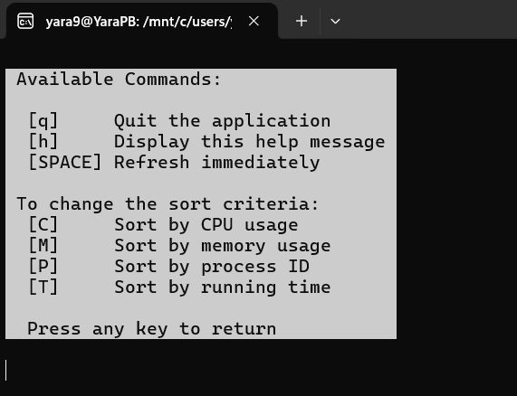

Name: Yara Kouttane 
ID: 136406

# mytop

## How to use the script

Please first make sure that you have the following installed: 

* sysstat (if not please run
 sudo apt install sysstat)
* procps (sudo apt install procps)

**To run the script** please run the following command on your terminal (after going to the directory where mytop.sh is stored):
./mytop.sh

## Command-line options and interactive commands



```shell
 Available Commands:

  [q]     Quit the application
  [h]     Display this help message
  [SPACE] Refresh immediately

 To change the sort criteria:
  [C]     Sort by CPU usage
  [M]     Sort by memory usage
  [P]     Sort by process ID
  [T]     Sort by running time

  Press any key to return
```

And if no key was inserted or an incompatible key then the system waits 5 seconds and automatically refreshes itself

## Implementation details

This project has implemented all the requirements and advanced features present in the  requirements. The implementation is modular and relies on standard Unix utilities like ps, uptime, free, mpstat and awk

* Current time and system uptime and Load averages (e.g., 1min, 5min, and 15 minutes) 

```shell
printf "${BLUE}Current time:${NC} %-8s  ${BLUE}Uptime:${NC} %-10s  ${BLUE}Load(1m):${NC} %-5s  ${BLUE}Load(5m):${NC} %-5s  ${BLUE}Load(15m):${NC} %-5s\n" \
"$(uptime | cut -d' ' -f2)" \
"$(uptime -p | cut -d' ' -f2-)" \
"$(uptime | awk '{print $(NF-2)}')" \
"$(uptime | awk '{print $(NF-1)}')" \
"$(uptime | awk '{print $NF}')"
```

* Total number of processes (running, sleeping, stopped) 

```shell
ps -eo stat | awk -v BLUE="$(tput setaf 4)" -v YELLOW="$(tput setaf 3)" -v NC="$(tput sgr0)" '
  BEGIN {
    R = 0
    S = 0
    T = 0
    total = 0
  }

  # Skip the header (NR > 1 to process only process lines)
  NR > 1 {
    state = substr($1, 1, 1)
    if (state == "R") R++
    else if (state == "S") S++
    else if (state == "T") T++
    total++
  }

  END {
    printf "\n%sTotal number of processes:%s %d ", BLUE, NC, total
    printf "%s(Running:%s %d, %sSleeping:%s %d, %sStopped:%s %d%s)%s\n", YELLOW, NC, R, YELLOW, NC, S, YELLOW, NC, T, YELLOW, NC
  }
'

```

* CPU usage percentage (user, system)
```shell
mpstat | awk -v PURPLE="$PURPLE" -v NC="$NC" '
BEGIN {
  printf PURPLE "CPU USAGE\t %-12s %-12s" NC "\n", "User Usage", "System Usage"
}
END {
  printf "\t\t %-12s %-12s\n", $3, $5
}'
```

* Memory usage (total, used, free)
```shell
free -m | awk -v PURPLE="$PURPLE" -v NC="$NC" '
BEGIN {
  printf PURPLE "%-12s %12s %12s %12s" NC "\n", "", "total(MiB)", "used(MiB)", "free(MiB)"
}
NR==2 || NR==3 {
  printf "%-12s %12s %12s %12s\n", $1, $2, $3, $4
}'
```

* Display processes infromations
```shell
ps -eo pid,user,pri,pcpu,pmem,comm,time --sort=-$SORT | head -n "$process_lines" | awk -v GREEN="$GREEN" -v GREY="$GREY" -v RED_BG="$RED_BG" -v LIGHT_YELLOW_BG="$LIGHT_YELLOW_BG" -v WHITE_BG="$WHITE_BG" -v BLACK="$BLACK" -v NC="$NC" '
BEGIN {
     printf "%s%s%-5s %-10s %-5s %-5s %-5s %-20s %s%s\n", WHITE_BG, BLACK, "PID", "USER", "PRI", "CPU%", "MEM%", "COMMAND", "TIME    ", NC
}
NR==1 { next }
{
    cpu = $4 + 0
    mem = $5 + 0

    # default colors by user
    fg = ($2 == "root") ? GREY : GREEN
    bg = ""

    # Apply background color by usage
    if (cpu > 5 || mem > 1) bg = RED_BG
    else if (cpu > 2.5 || mem > 0.5) bg = LIGHT_YELLOW_BG

    printf "%s%s%-5s %-10s %-5s %-5s %-5s %-20s %s%s\n", bg, fg, $1, $2, $3, $4, $5, $6, $7, NC
}'
```

> Also please note that in order to implement the coloring and the counting of different process states (running, sleeping and stopped) are implemented using the **awk** scripting language

* Color-coded output

I implemented tput for cross platform comaptibility

```shell
BLACK=$(tput setaf 0)
GREEN=$(tput setaf 2)
NC=$(tput sgr0)
YELLOW=$(tput setaf 3)
BLUE=$(tput setaf 4)
PURPLE=$(tput setaf 5)
WHITE=$(tput setaf 7) 
WHITE_BG=$(tput setab 7)
# sometimes the grey background is not available
GREY_BG=$(tput setab 235 2>/dev/null || echo "") 
GREY=$(tput setaf 8)   
RED_BG=$(tput setab 9)
LIGHT_YELLOW_BG=$(tput setab 11)
```

* Refresh every 5 seconds +  Interactive commands + sorting capabilities

```shell
  read -t 5 -n 1 input 

  if [[ $? -eq 0 ]]; then 
      case "$input" in
          " ")
              continue ;; 
          [cC]) SORT="pcpu" ;;
          [mM]) SORT="pmem" ;;
          [pP]) SORT="pid"  ;;
          [tT]) SORT="time" ;;
          [qQ])
              exit 0 ;;
          [hH])
              clear
              show_help ;;
      esac
  fi
done
```

## Known limitations 

1. There is no scroll feature for the processes so the user has to make the displays smaller untill all the processes are shown within the screen

2. If the user has a terminal with less than 19 rows (the reserved lines):
```shell
# line count to reserve (command bar + padding)
    overhead_lines=19
    reserved=1
    process_lines=$((rows - overhead_lines - reserved))
```

Then all of the processes will be displayed at once asnd the UI will not properly

3.  The high CPU and memory usage differ from machine to machine so it was hard to decide on a number that I saw as the average on my own machine to display the outputs of the background colors 

```shell
 # Apply background color by usage
    if (cpu > 5 || mem > 1) bg = RED_BG
    else if (cpu > 2.5 || mem > 0.5) bg = LIGHT_YELLOW_BG
```

## Future improvements

1. Implement a scrollable user interface

2. CPU utilization per core
We could have implemented:
```shell
mpstat -P ALL
```
to get a more precise and comprehensive view 

3. Let the user specify the frequency of the refreshes